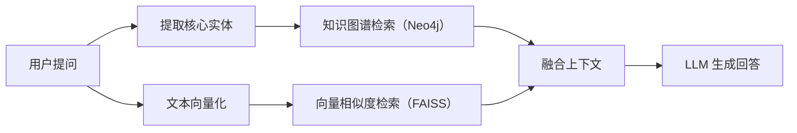

# 🧠 基于图谱增强的问答助手 (GraphRAG Assistant)

[](https://graph-rag-assistant.streamlit.app)

这是一个融合了**向量检索 (FAISS)** 与**知识图谱 (Neo4j)** 的新一代多模态文档对话助手。本项目旨在解决传统 RAG（检索增强生成）在处理复杂逻辑推理和深层实体关联时表现不足（容易丢失全局上下文）的问题，特别适用于化学文献、技术手册等高密度知识场景。

## ✨ 核心特性

- **🚀 突破限流的高并发批处理**：针对大模型 API 的速率限制（Rate Limit），设计了“合并批处理 + 轻量级多线程”的工程架构，将长文本知识抽取速度提升数十倍，同时保证系统稳定性。
- **🕸️ 知识图谱自动构建**：自动从长文本中精准抽取实体与关系（三元组），并安全、持久化地存储至 Neo4j Aura 云端图数据库。
- **🔍 混合检索引擎 (Dual-Recall)**：在用户提问时，同时触发 FAISS 向量相似度检索与 Neo4j 知识图谱关联检索，将“非结构化文本”与“结构化关系”双路召回，为大模型提供完美的上下文。
- **📊 交互式可视化界面**：基于 Streamlit 构建的前端，支持 PDF 拖拽解析、动态图谱节点拖拽交互，并在问答时透明展示“大脑的推理与检索过程”。

## 🏗️ 系统架构



## 🛠️ 技术栈

- **前端交互**: Streamlit, streamlit-agraph (图谱渲染)
- **核心逻辑**: LangChain, OpenAI API 协议兼容
- **向量检索**: FAISS (本地纯内存/磁盘检索引擎)
- **图谱存储**: Neo4j (Aura 云端实例)
- **文档处理**: pdfplumber, RecursiveCharacterTextSplitter

## ⚙️ 本地运行指南

1. 克隆本仓库到本地：
    ```bash
    git clone https://github.com/你的用户名/graph-rag-assistant.git
    cd graph-rag-assistant
    ```

2. 安装依赖包：
    ```bash
    pip install -r requirements.txt
    ```

3. 在项目根目录创建 `.env` 文件，并配置以下环境变量：
    ```env
    # 大语言模型（对话与抽取）
    LLM_API_BASE="你的大模型API地址"
    LLM_API_KEY="你的大模型API密钥"
    LLM_MODEL="你的大模型名称"

    # Embedding 模型（向量化）
    EMBED_API_BASE="你的向量API地址"
    EMBED_API_KEY="你的向量API密钥"
    EMBED_MODEL="你的向量模型名称"

    # Neo4j 图数据库
    NEO4J_URI="你的Neo4j地址"
    NEO4J_USER="你的Neo4j用户名"
    NEO4J_PASSWORD="你的Neo4j密码"
    ```

4. 启动应用：
    ```bash
    streamlit run app.py
    ```
