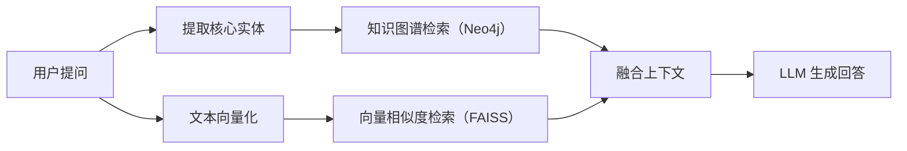

# 🧠 图谱增强问答助手 (GraphRAG Assistant)
## 全称：基于知识图谱增强的智能问答系统

[](https://graph-rag-assistant.streamlit.app)

本项目是融合 **FAISS 向量检索** 与 **Neo4j 知识图谱** 的 GraphRAG 智能问答系统，针对专业文献、技术文档等高密度知识场景设计，解决了传统 RAG 模型复杂逻辑推理弱、实体关联能力不足的问题，可实现精准的知识检索与智能问答。

## ✨ 核心特性
- **知识图谱自动化构建**：自动抽取文本中的实体与关系，构建结构化知识三元组，持久化存储至云端 Neo4j 图数据库。
- **双引擎混合检索**：融合向量相似度检索与知识图谱关联检索，结合非结构化文本与结构化关系，大幅提升问答准确性。
- **突破限流的高并发批处理**：针对大模型 API 的速率限制（Rate Limit），设计了“合并批处理 + 轻量级多线程”的工程架构，大幅提升长文本知识抽取速度，同时保证系统稳定性。
- **交互式可视化界面**：基于 Streamlit 实现轻量化前端，支持文档解析、问答交互、知识图谱动态可视化展示。
- **科研场景适配**：专为文献、专业知识文档优化，适用于化学、理工等专业领域的知识管理与智能问答。

## 🏗️ 系统架构



## 🛠️ 技术栈

- **前端交互**: Streamlit, streamlit-agraph (图谱渲染)
- **核心逻辑**: LangChain, OpenAI API 协议兼容
- **向量检索**: FAISS (本地纯内存/磁盘检索引擎)
- **图谱存储**: Neo4j (Aura 云端实例)
- **文档处理**: pdfplumber, RecursiveCharacterTextSplitter

## ⚙️ 本地运行指南

1. 克隆本仓库到本地：
    ```bash
    git clone https://github.com/你的用户名/graph-rag-assistant.git
    cd graph-rag-assistant
    ```

2. 安装依赖包：
    ```bash
    pip install -r requirements.txt
    ```

3. 在项目根目录创建 `.env` 文件，并配置以下环境变量：
    ```env
    # 大语言模型（对话与抽取）
    LLM_API_BASE="你的大模型API地址"
    LLM_API_KEY="你的大模型API密钥"
    LLM_MODEL="你的大模型名称"

    # Embedding 模型（向量化）
    EMBED_API_BASE="你的向量API地址"
    EMBED_API_KEY="你的向量API密钥"
    EMBED_MODEL="你的向量模型名称"

    # Neo4j 图数据库
    NEO4J_URI="你的Neo4j地址"
    NEO4J_USER="你的Neo4j用户名"
    NEO4J_PASSWORD="你的Neo4j密码"
    ```

4. 启动应用：
    ```bash
    streamlit run app.py
    ```
    
## 📄 许可证

本项目基于 [CC BY-NC-SA 4.0 协议](https://creativecommons.org/licenses/by-nc-sa/4.0/deed.zh) 开源，个人、非盈利组织可免费非商用使用、修改和分发本项目。
